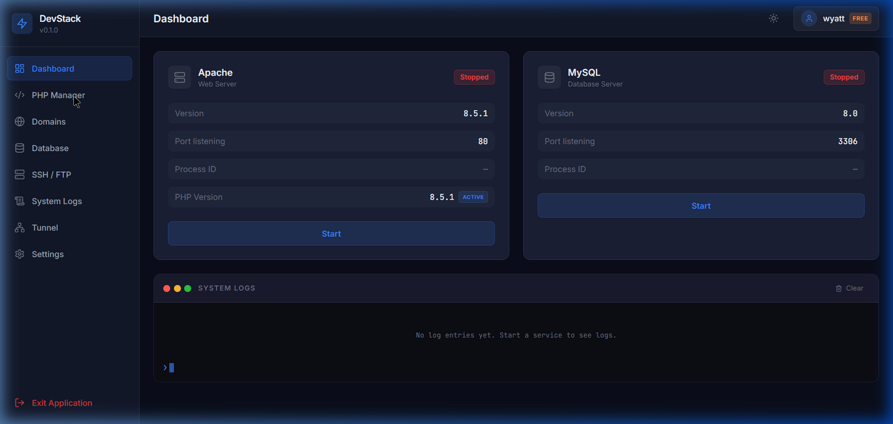
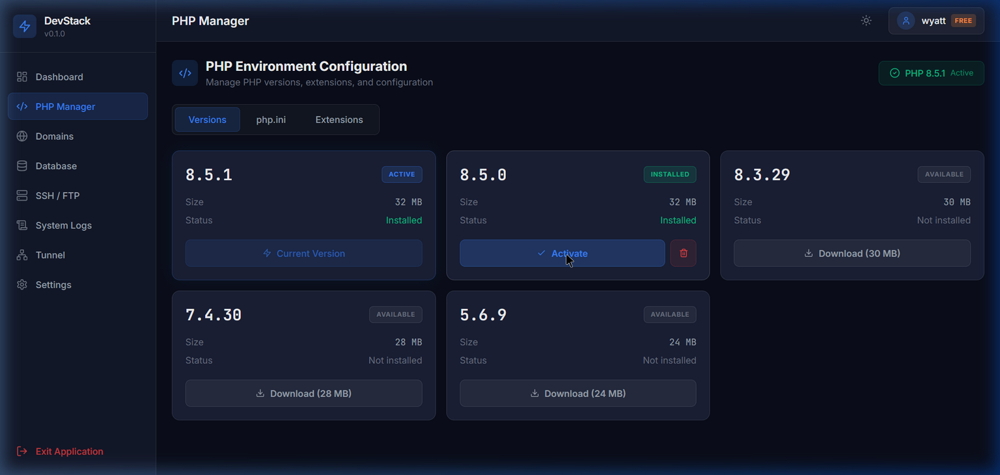
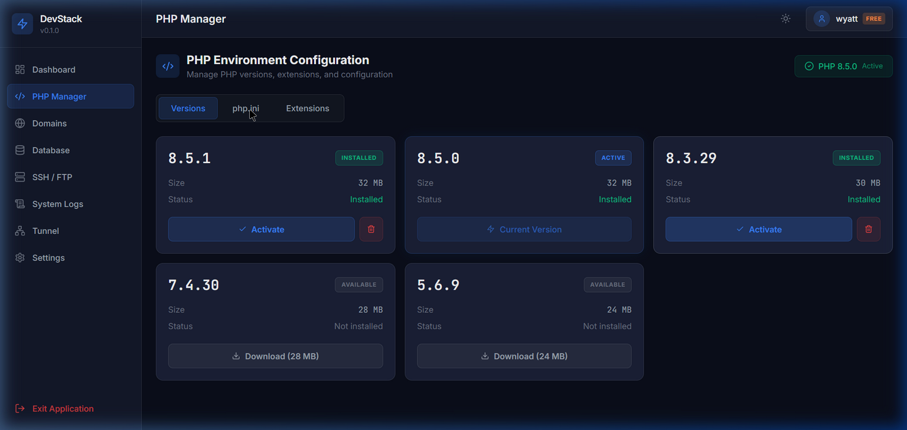
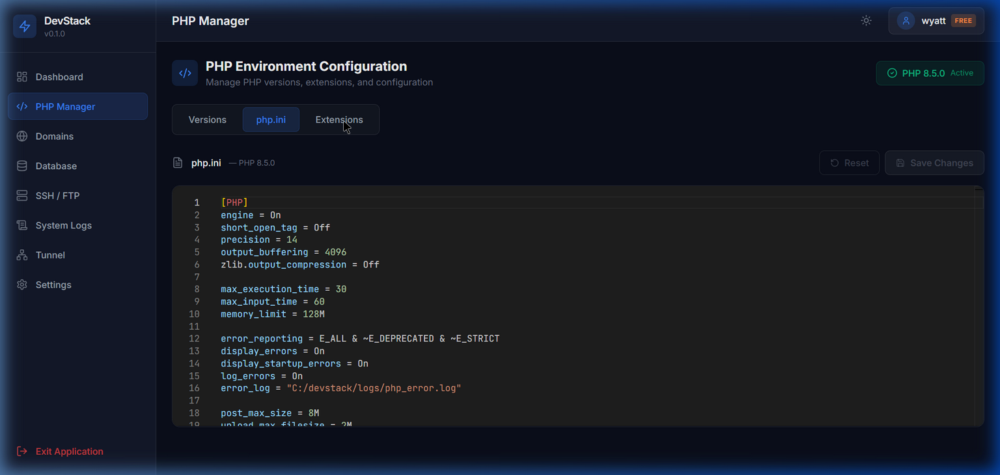
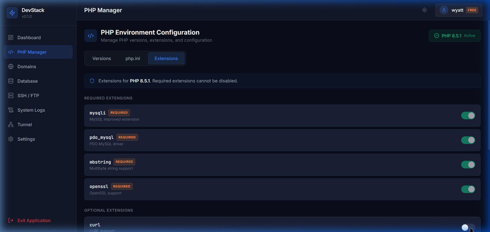
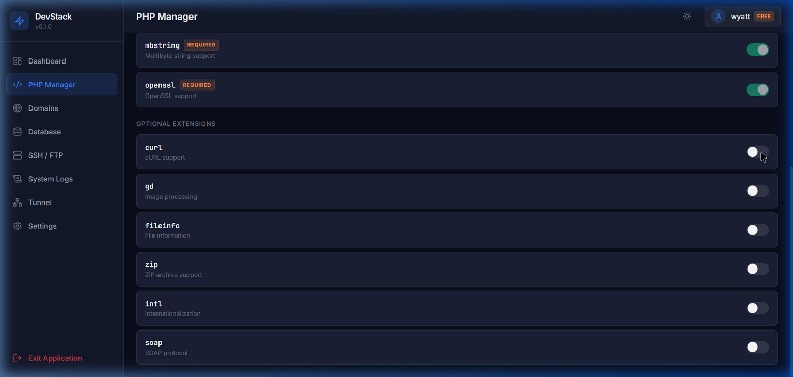

# Phase 2 Report — PHP Manager

**Project:** DevStack Local  
**Phase:** 2 of 8  
**Date:** April 10, 2026  
**Author:** NovWyatt  

---

## 📋 What Was Implemented

### New Files Created (11 files)

| File | Purpose |
|------|---------|
| `src/types/php.types.ts` | PHP type definitions (PhpVersion, PhpExtension, PhpOperationResult, PhpManagerTab) |
| `src/stores/usePhpStore.ts` | Zustand store for PHP state management |
| `src/components/php-manager/PhpManager.tsx` | Main PHP Manager page with tabbed interface |
| `src/components/php-manager/VersionList.tsx` | PHP version grid with status badges and action buttons |
| `src/components/php-manager/VersionDownloader.tsx` | Download progress modal with animated progress bar |
| `src/components/php-manager/PhpIniEditor.tsx` | Monaco-based php.ini configuration editor |
| `src/components/php-manager/ExtensionManager.tsx` | PHP extension toggle list with required/optional grouping |
| `electron/services/php.service.ts` | Semi-mock PHP version management backend service |

### Files Modified (6 files)

| File | Changes |
|------|---------|
| `electron/main.ts` | Added PhpService import, instantiation, 10 new IPC handlers for PHP operations |
| `electron/preload.ts` | Added 11 new PHP-related API methods to the contextBridge |
| `src/App.tsx` | Replaced Coming Soon placeholder with PhpManager route |
| `src/main.tsx` | Added Sonner Toaster provider with dark theme styling |
| `src/components/dashboard/ServiceCard.tsx` | Added PHP version info row to Apache card |
| `tailwind.config.js` | Added `border-color-hover` design token |

### Key Features Implemented

1. **PHP Version Management**
   - 5-version catalog (8.5.1, 8.5.0, 8.3.29, 7.4.30, 5.6.9)
   - 3-column responsive grid layout with version cards
   - Status badges: ACTIVE (blue), INSTALLED (green), AVAILABLE (gray)
   - One-click version activation with instant UI state update

2. **Simulated Download System**
   - Modal overlay with animated progress bar (0-100%)
   - Real-time file size tracking display
   - Auto-close on completion with success toast notification
   - 150ms per 5% increment = ~3 second simulated download

3. **php.ini Configuration Editor**
   - Monaco Editor with `ini` language support and `vs-dark` theme
   - Lazy-loaded for code splitting (~5MB Monaco bundle loaded on demand)
   - Unsaved changes tracking with visual indicator badge
   - Save and Reset buttons with loading states
   - JetBrains Mono font, line numbers, smooth scrolling

4. **Extension Manager**
   - 10 common extensions (4 required, 6 optional)
   - Grouped into Required and Optional sections
   - Custom toggle switches with smooth animations
   - Required extensions locked (cannot be disabled)
   - Toast notifications on toggle

5. **Toast Notification System**
   - Sonner integration with dark-themed toast styling
   - Success notifications for all operations
   - Error notifications for failures

6. **Dashboard Integration**
   - Apache service card now shows "PHP Version: 8.5.1 Active" row
   - Updates in real-time when active version changes in PHP Manager

---

## ✅ Testing Results

### Functional Tests

| Test | Status | Notes |
|------|--------|-------|
| PHP Manager page loads from sidebar | ✅ Pass | Route `/php-manager` renders correctly |
| Version list displays 5 PHP versions | ✅ Pass | All versions with correct sizes shown |
| Active version (8.5.1) has ACTIVE badge | ✅ Pass | Blue badge + "Current Version" button |
| Download button appears for non-installed versions | ✅ Pass | Shows size in button text |
| Simulated download works (progress bar 0-100%) | ✅ Pass | Smooth animation, auto-close |
| After download, card updates to "Installed" | ✅ Pass | Badge changes, Activate button appears |
| Activate button switches active PHP version | ✅ Pass | Header and badges update instantly |
| Previous active version becomes "Installed" | ✅ Pass | Activate button and remove button appear |
| php.ini editor loads content correctly | ✅ Pass | Full php.ini with sections visible |
| php.ini shows "Unsaved changes" indicator | ✅ Pass | Orange badge appears on edit |
| Save button persists php.ini changes | ✅ Pass | Toast notification confirms save |
| Reset button reverts to last saved state | ✅ Pass | Content reverts, indicator clears |
| Extension list displays all 10 extensions | ✅ Pass | Grouped into Required/Optional |
| Extension toggle switches work | ✅ Pass | Green when on, gray when off |
| Required extensions cannot be toggled off | ✅ Pass | Toggle is disabled + dimmed |
| Toast notifications appear for all actions | ✅ Pass | Consistent dark-themed toasts |
| Dashboard Apache card shows active PHP version | ✅ Pass | Shows "8.5.1 Active" row |
| Tab switching works smoothly | ✅ Pass | No lag or re-render flicker |
| Multiple versions can be downloaded | ✅ Pass | Tested 8.5.0 and 8.3.29 |
| Version removal works (remove button) | ✅ Pass | Card reverts to "Available" |

### UI/UX Tests

| Test | Status | Notes |
|------|--------|-------|
| Tabs switch smoothly without lag | ✅ Pass | Instant content swap |
| Version cards have proper hover effects | ✅ Pass | Border color changes on hover |
| Monaco Editor theme matches app | ✅ Pass | vs-dark with matching background |
| Download progress bar animates smoothly | ✅ Pass | Gradient animation with ease-out |
| Toast notifications are readable | ✅ Pass | Dark theme, proper contrast |
| All buttons have proper states | ✅ Pass | Loading spinners, disabled states |
| Layout is responsive (3-col, 2-col, 1-col) | ✅ Pass | Grid collapses properly |
| No console errors or warnings | ✅ Pass | Clean console |

### Code Quality Tests

| Test | Status | Notes |
|------|--------|-------|
| TypeScript types properly defined | ✅ Pass | Separate `php.types.ts` file |
| No `any` types used | ✅ Pass | Only 1 controlled `eslint-disable` for Electron API |
| Components follow single responsibility | ✅ Pass | 5 focused components |
| State management is clean | ✅ Pass | Zustand with proper selectors |
| Error handling implemented | ✅ Pass | Try-catch on all async operations |
| Monaco Editor lazy-loaded | ✅ Pass | Code-split with React.lazy + Suspense |
| Production build succeeds | ✅ Pass | Built in 2.30s |

---

## 📸 Screenshots

### PHP Manager — Versions Tab

### PHP Manager — Download & Activate

### PHP Manager — Multiple Versions Installed

### PHP Manager — php.ini Editor

### PHP Manager — Extensions Tab

### PHP Manager — Extension Toggle with Toast

---

## ⚠️ Known Issues & Limitations

1. **Semi-Mock Backend** — PHP versions are not real downloads; files are stored in memory only. Real binary management comes in Phase 4.
2. **No Persistent State** — Installed versions reset on page refresh (in-memory mock). Will be resolved with `electron-store` in Phase 5.
3. **No Version Deletion Confirmation** — The remove button acts immediately. A confirmation dialog should be added.
4. **Monaco Initial Load** — First load of the php.ini tab takes ~1-2s to lazy-load the Monaco bundle. Subsequent loads are instant.
5. **Extension Changes Not Synced to php.ini** — Toggling an extension updates the store but doesn't refresh the php.ini editor content live. User must switch tabs to see the change.

---

## 📊 Code Quality Metrics

| Metric | Value |
|--------|-------|
| New TypeScript files | 8 |
| Modified files | 6 |
| New React components | 5 |
| New Zustand stores | 1 |
| New type definitions | 4 interfaces/types |
| New IPC handlers | 10 |
| Lines of code added (approx) | ~1,500 |
| Production bundle (CSS) | 19.77 KB (4.63 KB gzip) |
| Production bundle (JS) | 281 KB (86.8 KB gzip) |
| Monaco Editor chunk | Lazy-loaded, ~5MB |
| Build time | 2.30s |

---

## 🔮 Recommendations for Phase 3

1. **Domain Management** — Virtual host configuration with `.test` TLD auto-setup
2. **Database Manager** — phpMyAdmin integration and database CRUD operations
3. **Real PHP Binary Downloads** — Replace mock downloads with actual PHP zip extraction from windows.php.net
4. **Persistent Settings** — Use `electron-store` to save PHP version selections, extension states, and custom php.ini edits
5. **Version Deletion Confirmation** — Add a confirmation dialog before removing installed PHP versions
6. **PHP Info Page** — Show `phpinfo()` output in a webview for the active PHP version

---

## ✅ Phase 2 Completion Checklist

- [x] PHP Manager page accessible from sidebar
- [x] Version list displays correctly (5 versions)
- [x] Active version badge works
- [x] Download simulation works with progress bar
- [x] Version activation works
- [x] php.ini editor loads content with Monaco
- [x] php.ini editor saves changes
- [x] Unsaved changes indicator works
- [x] Extension list displays (10 extensions)
- [x] Extension toggles work
- [x] Required extensions cannot be disabled
- [x] Toast notifications work for all actions
- [x] Dashboard shows active PHP version
- [x] All TypeScript types defined
- [x] No console errors
- [x] Code is clean and documented
- [x] PHASE2_REPORT.md complete
- [x] Code committed to GitHub
